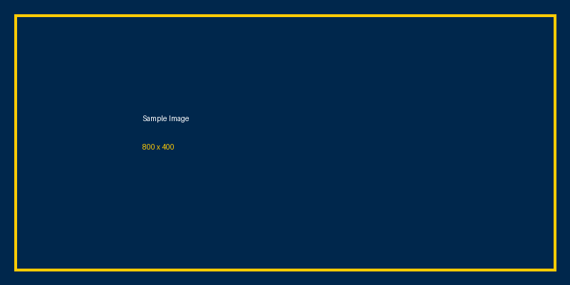

## Section Divider {background-color="#00274C" .section-divider}

## Standard Content Slide

This is what a regular slide looks like.

- Bullet points with **bold** and *emphasized* text
- Second point
- Nested lists work too:
  - Sub-item one
  - Sub-item two

> Blockquotes have an accent border and subtle background.

## Two-Column Layout

:::: {.columns}

::: {.column width="50%"}
### Left Column

- First point
- Second point
- Third point
:::

::: {.column width="50%"}
### Right Column

- Another point
- And another
- One more
:::

::::

## Table Example

| Feature | Status | Notes |
|---------|--------|-------|
| Dark headers | Done | Styled via theme |
| Alternating rows | Done | Subtle striping |
| Clean borders | Done | Light separators |

## Image Example

{fig-alt="A dark blue rectangle with a maize border containing the text Sample Image 800x400"}

::: {.notes}
Speaker notes go here. Press S during the presentation to open speaker view.
:::

## Thank You {background-color="#00274C" .section-divider}

Questions & Discussion
